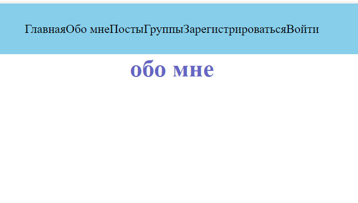
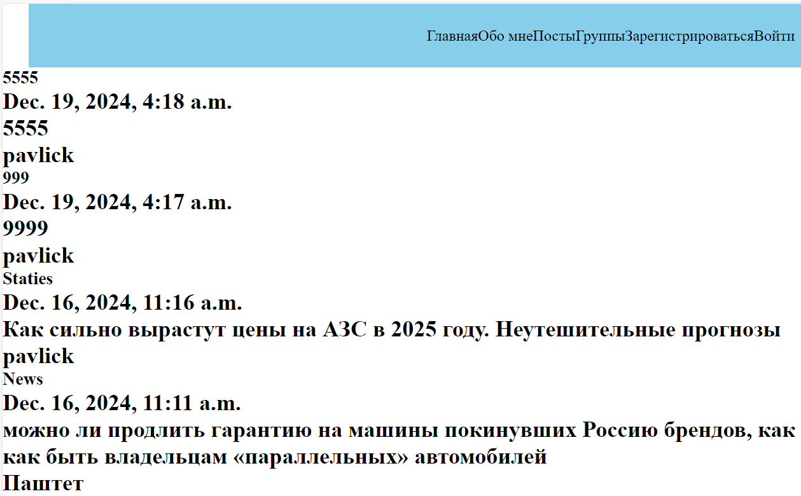
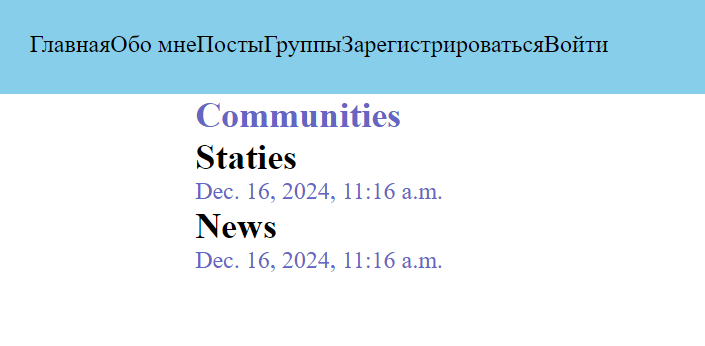

<h1 align="center">Hello dear developers, it's discriptions for starting use my site</h1>

Avto History is a website dedicated to providing detailed historical information about automobiles, including their development, design, and impact on society. It often features articles, timelines, and resources related to various car brands, models, and significant milestones in the automotive industry. The site may also cover topics such as classic cars, automotive technology advancements, and the evolution of car culture over the decades. Whether you're a car enthusiast or just curious about the history of vehicles, Avto History serves as an informative platform to explore the rich heritage of automobiles.

<h1 align="center">Before if u can joined on my site need, starting localhost</h1>

## 1.first what u need it's join a folder lab1.

```
cd lab1
```
## 2.Second it's starting local server.

```
py manage.py runserver
```
or 
```
python manage.py runserver
```

### * You have 2 options how to start server, they differs python may not be installed on your PC.
### 3. After you starting local server need in searching area write - [site](localhost:8000)


<h2 align="center"> First page if you see it's Main page</h2>

### On this page sometimes i be post most needed information


<h2 align="center"> Second page wheres info about me  </h2>



<h2 align="center">Third page it's posts they apper news </h2>



<h2 align="center">Forth page - communities</h2>




